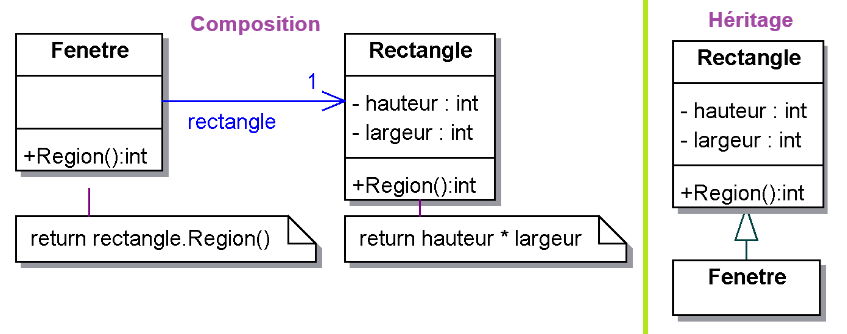
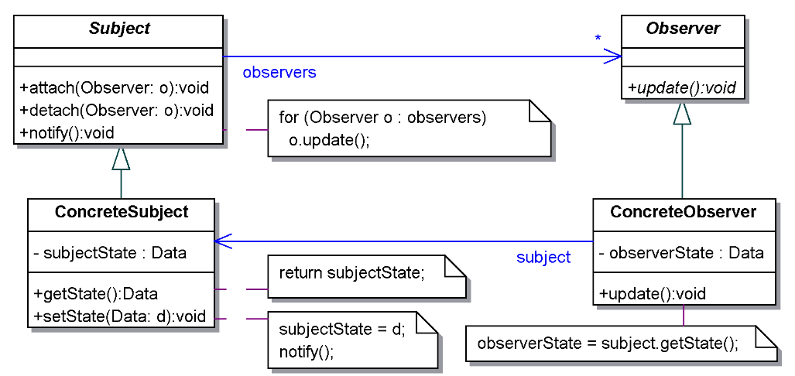

# MCR - Résumé


## Principes généraux

### Encapsulation

Les classes devraient être opaques. l’encapsulation permet de masquer la structure interne et les détails d’implémentation d’un objet. les interactions avec un objet s’effectuent au moyen des opérations définies dans son interface publique.

la représentation interne de la classe peut être modifiée sans impacter sur son interface => pas de modification des classes y accédant

### Composition vs héritage



Inconvénients de l'héritage:

- Défini statiquement à la compilation, pas de modification ultérieure possible.
- L’implémentation des super classes (attributs protected) est généralement visible depuis les sous classes, les sous-classes sont dépendantes des l'implémentation des classes parent. Si la classe parent change, il y a un risque que ça affecte les sous-classes.

#### Composition

- Contrairement à l'héritage, la composition force les objets à interagir uniquement via leurs interfaces publiques, maintenant ainsi une stricte séparation entre l'interface et l'implémentation.

- Avec la composition, les objets sont moins couplés. Chaque objet ne dépend que des interfaces des autres objets, et non de leurs implémentations spécifiques. ça réduit les dépendances et facilite les modifications ou les extensions sans affecter le code appelant

- Avec la composition, chaque classe peut se concentrer sur une seule responsabilité. Plutôt que de créer des hiérarchies complexes par héritage, où une classe hérite de multiples responsabilités, la composition permet de créer des structures plus simples et plus faciles à comprendre.

-  En utilisant des interfaces, la composition permet de combiner des objets de classes différentes qui n'ont pas de relation d'héritage. Les objets implémentent la même interface, ils peuvent être utilisés de manière interchangeable dans la même composition.

**Exemple :**

````java
interface Notification { void send(String message); }

class EmailNotification implements Notification {
    public void send(String message) {
        System.out.println("Sending email: " + message);
    }
}

class SMSNotification implements Notification {
    public void send(String message) {
        System.out.println("Sending SMS: " + message);
    }
}

class NotificationService {
    private Notification notification;

    public NotificationService(Notification notification) {
        this.notification = notification;
    }

    public void notifyUser(String message) {
        notification.send(message);
    }
}

public class Main {
    public static void main(String[] args) {
        Notification email = new EmailNotification();
        Notification sms = new SMSNotification();

        NotificationService emailService = new NotificationService(email);
        NotificationService smsService = new NotificationService(sms);

        emailService.notifyUser("Hello via Email!");
        smsService.notifyUser("Hello via SMS!");
    }
}
````


#### Utilise l'héritage lorsque :

1. **Il existe une vraie relation "est-un" (is-a)** :  Par exemple, une `Voiture` est un type de `Véhicule`.
2. Si tu as besoin de réutiliser le code existant de la super classe et que la relation d'héritage est logique
3. Si tu veux que les instances de la sous-classe soient utilisées partout où les instances de la super classe sont attendues, ça permet de tirer parti du polymorphisme.

#### Utilise la composition lorsque :

1. **Il existe une relation "a-un" (has-a)** : Quand tu as besoin de créer des objets complexes en combinant des objets plus simples. Par exemple, une `Voiture` a un `Moteur`.
2. **Tu veux éviter les problèmes liés à la modification des super classes** : Avec la composition, les objets sont moins couplés, ce qui facilite la maintenance et l'évolution du code.
3. Tu veux utiliser des comportements dynamiques permettant de changer à l'exécution des objets composants par d'autres objets implémentant la même interface.


### Open-closed principle

- Ouvert : il doit être possible d’étendre une classe pour proposer des fonctionnalités non prévues lors de sa conception.
- Fermé : les extensions sont introduites sans modifier le code existant.

### Liskov substitution principle

Une méthode utilisant des objets d’une classe doit pouvoir utiliser des objets dérivés de cette classe sans même le savoir.

Concevoir **pour une interface**, pas pour une implémentation:

- Un objet peut implémenter plusieurs interfaces.
- Les clients ne connaissent pas la classe spécifique de l’objet utilisé.
- Un objet peut être facilement remplacé par un autre (types différents,mais mêmes interfaces).
- Séparation des interfaces: les clients ne doivent pas être forcés de dépendre d’interfaces qu’ils n’utilisent pas.

## 1 Observer



Diagramme plus parlant:


L'observateur peut être un singleton si utilisé de manière unique

## 2 Singleton


## 3 Factory


## 4 Abstract factory


## 5 Composite


## 6 Adapter


## 7 State


### 