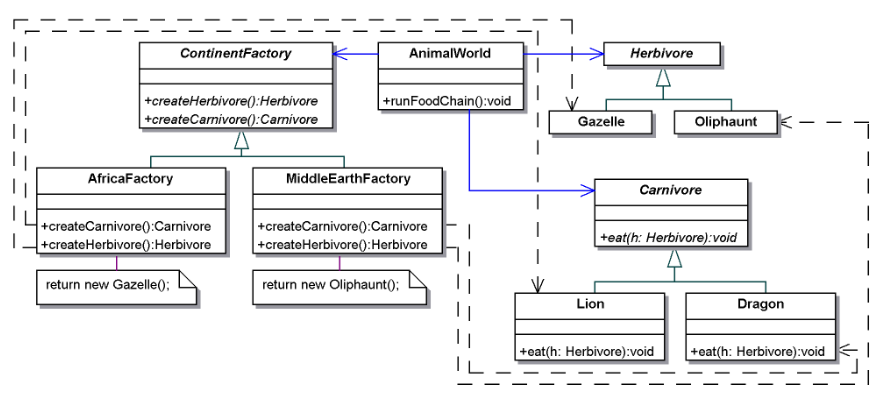

# MCR - Résumé

[toc]


## 1 Principes généraux

### 1.1 Encapsulation

Les classes devraient être opaques. l’encapsulation permet de masquer la structure interne et les détails d’implémentation d’un objet. les interactions avec un objet s’effectuent au moyen des opérations définies dans son interface publique.

la représentation interne de la classe peut être modifiée sans impacter sur son interface => pas de modification des classes y accédant

### 1.2 Composition vs héritage


Inconvénients de l'héritage:

- Défini statiquement à la compilation, pas de modification ultérieure possible.
- L’implémentation des super classes (attributs protected) est généralement visible depuis les sous classes, les sous-classes sont dépendantes des l'implémentation des classes parent. Si la classe parent change, il y a un risque que ça affecte les sous-classes.

#### Composition

- Contrairement à l'héritage, la composition force les objets à interagir uniquement via leurs interfaces publiques, maintenant ainsi une stricte séparation entre l'interface et l'implémentation.

- Avec la composition, les objets sont moins couplés. Chaque objet ne dépend que des interfaces des autres objets, et non de leurs implémentations spécifiques. ça réduit les dépendances et facilite les modifications ou les extensions sans affecter le code appelant

- Avec la composition, chaque classe peut se concentrer sur une seule responsabilité. Plutôt que de créer des hiérarchies complexes par héritage, où une classe hérite de multiples responsabilités, la composition permet de créer des structures plus simples et plus faciles à comprendre.

-  En utilisant des interfaces, la composition permet de combiner des objets de classes différentes qui n'ont pas de relation d'héritage. Les objets implémentent la même interface, ils peuvent être utilisés de manière interchangeable dans la même composition.

**Exemple :**

````java
interface Notification { void send(String message); }

class EmailNotification implements Notification {
    public void send(String message) {
        System.out.println("Sending email: " + message);
    }
}

class SMSNotification implements Notification {
    public void send(String message) {
        System.out.println("Sending SMS: " + message);
    }
}

class NotificationService {
    private Notification notification;

    public NotificationService(Notification notification) {
        this.notification = notification;
    }

    public void notifyUser(String message) {
        notification.send(message);
    }
}

public class Main {
    public static void main(String[] args) {
        Notification email = new EmailNotification();
        Notification sms = new SMSNotification();

        NotificationService emailService = new NotificationService(email);
        NotificationService smsService = new NotificationService(sms);

        emailService.notifyUser("Hello via Email!");
        smsService.notifyUser("Hello via SMS!");
    }
}
````

Ou avec des lambda:
````java
interface Notification {
    void send(String message);
}

class NotificationService {
    private Notification notification;

    public NotificationService(Notification notification) {
        this.notification = notification;
    }

    public void notifyUser(String message) {
        notification.send(message);
    }
}

public class Main {
    public static void main(String[] args) {
        // Utilisation de lambdas pour créer des instances de Notification
        Notification emailNotification = (message) -> System.out.println("Sending email: " + message);
        Notification smsNotification = (message) -> System.out.println("Sending SMS: " + message);

        NotificationService emailService = new NotificationService(emailNotification);
        NotificationService smsService = new NotificationService(smsNotification);

        emailService.notifyUser("Hello via Email!");
        smsService.notifyUser("Hello via SMS!");
    }
}
````

ou encore plus simple:

````java
interface Notification {
    void send(String message);
}

class NotificationService {
    private Notification notification;

    public NotificationService(Notification notification) {
        this.notification = notification;
    }

    public void notifyUser(String message) {
        notification.send(message);
    }
}

public class Main {
    public static void main(String[] args) {

        // Va construire un objet implémentant Notification et surchargeant la méthode send
        NotificationService emailService = new NotificationService((message) -> {
            System.out.println("Sending email: " + message);
        });
        NotificationService smsService = new NotificationService((message) -> {
            System.out.println("Sending sms: " + message);
        });

        emailService.notifyUser("Hello via Email!");
        smsService.notifyUser("Hello via SMS!");
    }
}
````


#### Utilise l'héritage lorsque :

1. **Il existe une vraie relation "est-un" (is-a)** :  Par exemple, une `Voiture` est un type de `Véhicule`.
2. Si tu as besoin de réutiliser le code existant de la super classe et que la relation d'héritage est logique
3. Si tu veux que les instances de la sous-classe soient utilisées partout où les instances de la super classe sont attendues, ça permet de tirer parti du polymorphisme.

#### Utilise la composition lorsque :

1. **Il existe une relation "a-un" (has-a)** : Quand tu as besoin de créer des objets complexes en combinant des objets plus simples. Par exemple, une `Voiture` a un `Moteur`.
2. **Tu veux éviter les problèmes liés à la modification des super classes** : Avec la composition, les objets sont moins couplés, ce qui facilite la maintenance et l'évolution du code.
3. Tu veux utiliser des comportements dynamiques permettant de changer à l'exécution des objets composants par d'autres objets implémentant la même interface.


### 1.3 Open-closed principle

- Ouvert : il doit être possible d’étendre une classe pour proposer des fonctionnalités non prévues lors de sa conception.
- Fermé : les extensions sont introduites sans modifier le code existant.

### 1.4 Liskov substitution principle

Une méthode utilisant des objets d’une classe doit pouvoir utiliser des objets dérivés de cette classe sans même le savoir.

Concevoir **pour une interface**, pas pour une implémentation:

- Un objet peut implémenter plusieurs interfaces.
- Les clients ne connaissent pas la classe spécifique de l’objet utilisé.
- Un objet peut être facilement remplacé par un autre (types différents,mais mêmes interfaces).
- Séparation des interfaces: les clients ne doivent pas être forcés de dépendre d’interfaces qu’ils n’utilisent pas.

## 2 Observer


Diagramme plus parlant:


L'observateur peut être un singleton si utilisé de manière unique


### 2.1 Exemple 

**`PropertyChangeListener` + interface fonctionnelle**

Interface:

````java
import java.beans.PropertyChangeListener;

@FunctionalInterface
public interface ListenerRegistrar {
    void register(PropertyChangeListener listener);
}
````

Sujet:

````java
import java.beans.PropertyChangeListener;
import java.beans.PropertyChangeSupport;

public class Subject {
    private String property;
    private PropertyChangeSupport support;

    public Subject() {
        this.support = new PropertyChangeSupport(this);
    }

    // Méthode pour obtenir une instance de ListenerRegistrar
    public ListenerRegistrar getListenerRegistrar() {
        return this::addPropertyChangeListener;
    }

    // Ajoute un PropertyChangeListener
    private void addPropertyChangeListener(PropertyChangeListener pcl) {
        support.addPropertyChangeListener(pcl);
    }

    // Supprime un PropertyChangeListener
    public void removePropertyChangeListener(PropertyChangeListener pcl) {
        support.removePropertyChangeListener(pcl);
    }

    // Méthode pour changer la propriété et notifier les observateurs
    public void setProperty(String value) {
        String oldValue = this.property;
        this.property = value;
        // Notifie les observateurs du changement de la propriété
        support.firePropertyChange("property", oldValue, this.property);
    }

    // Méthode pour obtenir la valeur de la propriété
    public String getProperty() {
        return property;
    }
}
````

Observer:

````java
import java.beans.PropertyChangeEvent;
import java.beans.PropertyChangeListener;

public class Observer implements PropertyChangeListener {
    private String observerName;

    public Observer(String observerName, ListenerRegistrar registrar) {
        this.observerName = observerName;
        registrar.register(this);
    }

    @Override
    public void propertyChange(PropertyChangeEvent evt) {
        // Affiche le changement de propriété
        System.out.println(observerName + " a été notifié. La propriété '"
                + evt.getPropertyName() + "' a changé de '"
                + evt.getOldValue() + "' à '"
                + evt.getNewValue() + "'.");
    }
}
````

Utilisation:

````java
public class Main {
    public static void main(String[] args) {
        // Créer le sujet
        Subject subject = new Subject();

        // Obtenir l'instance de ListenerRegistrar pour attacher les observateurs
        ListenerRegistrar registrar = subject.getListenerRegistrar();

        // Créer un observateur qui s'enregistre automatiquement auprès du sujet
        Observer observer1 = new Observer("Observateur 1", registrar);
        Observer observer2 = new Observer("Observateur 2", registrar);

        // Changer la propriété du sujet
        subject.setProperty("Valeur initiale");
        subject.setProperty("Nouvelle valeur");

        // Supprimer un observateur et changer la propriété
        subject.removePropertyChangeListener(observer1);
        subject.setProperty("Dernière valeur");
    }
}
````


## 3 Singleton

Garantit qu’une classe n’a qu’une seule instance et fournit un accès global à cette instance.

````java
public class Singleton {
    private static class Instance {
        static final Singleton instance = new Singleton();
    }

    private Singleton() { }

    public static Singleton getInstance() {
        return Instance.instance;
    }

    public void showMessage() {
        System.out.println("Bonjour, je suis une instance unique de Singleton !");
    }
}
````

Utilisation:

````java
public class Main {
    public static void main(String[] args) {
        // Obtention de l'unique instance du singleton
        Singleton singleton = Singleton.getInstance();

        // Appel d'une méthode de l'instance Singleton
        singleton.showMessage();
    }
}
````


## 4 Factory Method (modèle de classe => héritage)

On utilise le facory quand :

1. **Tu as une `hiérarchie` de classes produits** :
   - Tu veux déléguer la création d'objets à des sous-classes.
   - Tu as une classe de base et plusieurs sous-classes, et tu veux que chaque sous-classe décide quel objet créer.
2. **La création de l'objet peut varier** :
   - Tu veux permettre aux sous-classes de modifier la façon dont les objets sont créés.
   - Par exemple, tu as une classe `Document` avec une méthode `createPage()` que les sous-classes comme `WordDocument` ou `PDFDocument` peuvent implémenter pour créer des pages spécifiques à chaque type de document.
3. **Tu veux une seule famille de produits** :
   - Tu n'as besoin de créer qu'un seul type de produit.


La factory méthod utilise une interface pour créer des objets dans une classe parent, mais permet aux sous-classes de changer le type d'objet créé.


### 4.1 Exemple

````java
abstract class Document { // Creator abstrait
    public void newDocument() {
        Page page = createPage();
        page.render();
    }

    // Factory method
    protected abstract Page createPage();
}

class WordDocument extends Document { // Creator 1
    @Override
    protected Page createPage() {
        return new WordPage();
    }
}

class PDFDocument extends Document { // Creator 2
    @Override
    protected Page createPage() {
        return new PDFPage();
    }
}

interface Page {
    void render();
}

class WordPage implements Page { // Produit 1
    @Override
    public void render() {
        System.out.println("Rendering Word page");
    }
}

class PDFPage implements Page { // Produit 2
    @Override
    public void render() {
        System.out.println("Rendering PDF page");
    }
}

public class Main {
    public static void main(String[] args) {
        
        // Le créateur concret 1 créé le produit concret 1
        Document wordDoc = new WordDocument();
        wordDoc.newDocument();

        Document pdfDoc = new PDFDocument();
        pdfDoc.newDocument();
    }
}
````


## 5 Abstract factory (modèle objet => délégation)

On utilise le facory quand :

1. **Tu as plusieurs `familles` de produits** :
   - Tu veux créer des familles de produits liés ou dépendants les uns des autres.
   - Par exemple, tu veux créer des objets GUI (boutons, textes, etc.) pour différentes plateformes (Windows, MacOS, Linux).
2. **Tu veux garantir que les produits d'une même famille soient utilisés ensemble** :
   - Les produits créés par une famille sont conçus pour fonctionner ensemble.
3. **Tu veux centraliser la création d'objets complexes** :
   - La création d'objets peut impliquer plusieurs étapes ou la création de différents sous-objets.




### 5.1 Exemple

1. Définir les Interfaces des Produits

```java
// Interface pour les Soldats
interface Soldier {
    void attack();
}

// Interface pour les Véhicules
interface Vehicle {
    void move();
}
```

2. Implémenter les Produits Concrets

```java
// Soldats Atreides
class AtreidesSoldier implements Soldier {
    @Override
    public void attack() {
        System.out.println("Atreides soldier attacks with a lasgun!");
    }
}

// Véhicules Atreides
class AtreidesVehicle implements Vehicle {
    @Override
    public void move() {
        System.out.println("Atreides vehicle moves swiftly across the desert!");
    }
}

// Soldats Harkonnen
class HarkonnenSoldier implements Soldier {
    @Override
    public void attack() {
        System.out.println("Harkonnen soldier attacks with a flamethrower!");
    }
}

// Véhicules Harkonnen
class HarkonnenVehicle implements Vehicle {
    @Override
    public void move() {
        System.out.println("Harkonnen vehicle roars across the battlefield!");
    }
}
```

3. Définir l'Abstract Factory

```java
// Interface Abstract Factory
interface HouseFactory {
    Soldier createSoldier();
    Vehicle createVehicle();
}
```

4. Implémenter les Factories Concrètes

```java
// Factory pour la maison Atreides
class AtreidesFactory implements HouseFactory {
    @Override
    public Soldier createSoldier() {
        return new AtreidesSoldier();
    }

    @Override
    public Vehicle createVehicle() {
        return new AtreidesVehicle();
    }
}

// Factory pour la maison Harkonnen
class HarkonnenFactory implements HouseFactory {
    @Override
    public Soldier createSoldier() {
        return new HarkonnenSoldier();
    }

    @Override
    public Vehicle createVehicle() {
        return new HarkonnenVehicle();
    }
}
```

5. Utilisation du Pattern Abstract Factory

```java
public class Main {
    public static void main(String[] args) {
        // Créer une factory pour la maison Atreides
        HouseFactory atreidesFactory = new AtreidesFactory();
        Soldier atreidesSoldier = atreidesFactory.createSoldier();
        Vehicle atreidesVehicle = atreidesFactory.createVehicle();
        
        // Utiliser les produits créés
        atreidesSoldier.attack();
        atreidesVehicle.move();

        // Créer une factory pour la maison Harkonnen
        HouseFactory harkonnenFactory = new HarkonnenFactory();
        Soldier harkonnenSoldier = harkonnenFactory.createSoldier();
        Vehicle harkonnenVehicle = harkonnenFactory.createVehicle();
        
        // Utiliser les produits créés
        harkonnenSoldier.attack();
        harkonnenVehicle.move();
    }
}
```

Output:

````
Atreides soldier attacks with a lasgun!
Atreides vehicle moves swiftly across the desert!
Harkonnen soldier attacks with a flamethrower!
Harkonnen vehicle roars across the battlefield!
````


## 6 Composite

L’utilisation du modèle Composite est recommandée :

- pour représenter des hiérarchies de l’individu à l’ensemble 
- pour que le client n’ait pas à considérer les différences entre combinaison d’objets et objets individuels : ils seront traités de manière uniforme.


### 6.1 Exemple

```java
// Interface Component
interface Shape {
    void draw(String indentation);
}
```

```java
// Classe Leaf pour un cercle
class Circle implements Shape {
    @Override
    public void draw(String indentation) {
        System.out.println(indentation + "Drawing a Circle");
    }
}

// Classe Leaf pour un rectangle
class Rectangle implements Shape {
    @Override
    public void draw(String indentation) {
        System.out.println(indentation + "Drawing a Rectangle");
    }
}
```

```java
import java.util.ArrayList;
import java.util.List;

// Classe Composite pour un groupe de formes
class Group implements Shape {
    private List<Shape> shapes = new ArrayList<>();

    public void addShape(Shape shape) {
        shapes.add(shape);
    }

    public void removeShape(Shape shape) {
        shapes.remove(shape);
    }

    @Override
    public void draw(String indentation) {
        System.out.println(indentation + "Drawing a Group:");
        for (Shape shape : shapes) {
            shape.draw(indentation + "  ");
        }
    }
}
```

```java
public class Main {
    public static void main(String[] args) {
        // Créer des formes simples
        Shape circle1 = new Circle();
        Shape circle2 = new Circle();
        Shape rectangle = new Rectangle();

        // Créer un groupe de formes
        Group group1 = new Group();
        group1.addShape(circle1);
        group1.addShape(rectangle);

        // Créer un autre groupe de formes et ajouter un groupe existant
        Group group2 = new Group();
        group2.addShape(circle2);
        group2.addShape(group1);

        // Dessiner tous les groupes et formes
        group2.draw("");
    }
}
```

Output:

````
Drawing a Group:
  Drawing a Circle
  Drawing a Group:
    Drawing a Circle
    Drawing a Rectangle
````


## 7 Adapter

Le pattern Adapter est un design pattern structurel qui permet de convertir l'interface d'une classe en une autre interface que les clients attendent. Il permet à des classes qui ne pourraient pas normalement fonctionner ensemble en raison d'incompatibilités d'interfaces de collaborer.

1. **Client** : La classe qui utilise l'interface cible.
2. **Cible (Target)** : L'interface attendue par le client.
3. **Adapté (Adaptee)** : La classe existante qui doit être adaptée pour être compatible avec l'interface cible.
4. **Adaptateur (Adapter)** : La classe qui implémente l'interface cible et traduit les appels du client en appels à l'interface de l'adapté.


### 7.1 Exemple

1. Définir l'Interface Cible (Target)

```java
// Interface cible pour les personnages du jeu
interface Character {
    void attack();
}
```

2. Implémenter des Personnages Existants

```java
// Classe pour un guerrier Atreides
class AtreidesWarrior implements Character {
    @Override
    public void attack() {
        System.out.println("Atreides warrior attacks with a lasgun!");
    }
}

// Classe pour un guerrier Harkonnen
class HarkonnenWarrior implements Character {
    @Override
    public void attack() {
        System.out.println("Harkonnen warrior attacks with a sword!");
    }
}
```

3. Implémenter la Classe Adaptée (Adaptee)

```java
// Classe existante pour un guerrier Fremen avec une interface différente
class FremenWarrior {
    public void crySkirmish() {
        System.out.println("Fremen warrior cries 'Muad'Dib!' and attacks with a crysknife!");
    }
}
```

4. Implémenter l'Adaptateur (Adapter)

```java
// Adaptateur qui adapte FremenWarrior à l'interface Character
class FremenWarriorAdapter implements Character {
    
    private static class Instance {
        static final Singleton instance = new Singleton();
    }

    private Singleton() { }

    public static Singleton getInstance() {
        return Instance.instance;
    }
    
    private FremenWarrior fremenWarrior;

    public FremenWarriorAdapter(FremenWarrior fremenWarrior) {
        this.fremenWarrior = fremenWarrior;
    }

    @Override
    public void attack() {
        // Adapter l'appel à l'interface de FremenWarrior
        fremenWarrior.crySkirmish();
    }
}
```

5. Utilisation du Pattern Adapter

```java
public class Main {
    public static void main(String[] args) {
        // Créer des personnages existants
        Character atreidesWarrior = new AtreidesWarrior();
        Character harkonnenWarrior = new HarkonnenWarrior();

        // Créer un guerrier Fremen
        FremenWarrior fremenWarrior = new FremenWarrior();

        // Adapter le guerrier Fremen pour qu'il corresponde à l'interface Character
        Character fremenAdapter = new FremenWarriorAdapter(fremenWarrior);

        // Ajouter les personnages dans un tableau pour simuler une bataille
        Character[] characters = { atreidesWarrior, harkonnenWarrior, fremenAdapter };

        // Simuler une attaque de chaque personnage
        for (Character character : characters) {
            character.attack();
        }
    }
}
```

Output:

````
Atreides warrior attacks with a lasgun!
Harkonnen warrior attacks with a sword!
Fremen warrior cries 'Muad'Dib!' and attacks with a crysknife!
````


## 8 State

 Le pattern State est un design pattern comportemental qui permet à un objet de changer son comportement lorsque son état change. Ce pattern est particulièrement utile pour les objets qui peuvent être dans un ou plusieurs états et dont le comportement varie en fonction de l'état actuel.

Concept du pattern:

1. **Context** : La classe qui contient l'état actuel de l'objet et délègue le comportement à l'objet état.
2. **State** : Une interface ou une classe abstraite qui définit les comportements associés à un état particulier.
3. **Concrete States** : Les classes concrètes qui implémentent les comportements spécifiques pour chaque état.

### 8.1 Exemple


1. Définir l'Interface State

```java
// Interface State
interface State {
    void attack(FremenWarrior warrior);
    void defend(FremenWarrior warrior);
    void rest(FremenWarrior warrior);
}
```

2. Implémenter les États Concrets

```java
// État de repos (Idle)
class IdleState implements State {
    @Override
    public void attack(FremenWarrior warrior) {
        System.out.println("Fremen warrior starts attacking!");
        warrior.setState(new AttackingState()); // Set state quand on change d'état
    }

    @Override
    public void defend(FremenWarrior warrior) {
        System.out.println("Fremen warrior starts defending!");
        warrior.setState(new DefendingState());
    }

    @Override
    public void rest(FremenWarrior warrior) {
        System.out.println("Fremen warrior is already resting.");
    }
}

// État d'attaque
class AttackingState implements State {
    @Override
    public void attack(FremenWarrior warrior) {
        System.out.println("Fremen warrior is already attacking!");
    }

    @Override
    public void defend(FremenWarrior warrior) {
        System.out.println("Fremen warrior switches to defending!");
        warrior.setState(new DefendingState());
    }

    @Override
    public void rest(FremenWarrior warrior) {
        System.out.println("Fremen warrior stops attacking and rests.");
        warrior.setState(new IdleState());
    }
}

// État de défense
class DefendingState implements State {
    @Override
    public void attack(FremenWarrior warrior) {
        System.out.println("Fremen warrior switches to attacking!");
        warrior.setState(new AttackingState());
    }

    @Override
    public void defend(FremenWarrior warrior) {
        System.out.println("Fremen warrior is already defending!");
    }

    @Override
    public void rest(FremenWarrior warrior) {
        System.out.println("Fremen warrior stops defending and rests.");
        warrior.setState(new IdleState());
    }
}
```

3. Implémenter le Contexte

```java
class FremenWarrior {
    private State state;

    public FremenWarrior() {
        // Initialement en état de repos
        this.state = new IdleState();
    }

    public void setState(State state) {
        this.state = state;
    }

    public void attack() {
        state.attack(this);
    }

    public void defend() {
        state.defend(this);
    }

    public void rest() {
        state.rest(this);
    }
}
```

4. Utilisation du Pattern State

```java
public class Main {
    public static void main(String[] args) {
        FremenWarrior warrior = new FremenWarrior();

        // Essayer de différentes actions et observer les transitions d'état
        warrior.attack();  // Idle -> Attacking
        warrior.defend();  // Attacking -> Defending
        warrior.rest();    // Defending -> Idle
        warrior.rest();    // Idle -> Idle
        warrior.defend();  // Idle -> Defending
        warrior.attack();  // Defending -> Attacking
    }
}
```

output:

````
Fremen warrior starts attacking!
Fremen warrior switches to defending!
Fremen warrior stops defending and rests.
Fremen warrior is already resting.
Fremen warrior starts defending!
Fremen warrior switches to attacking!
````

